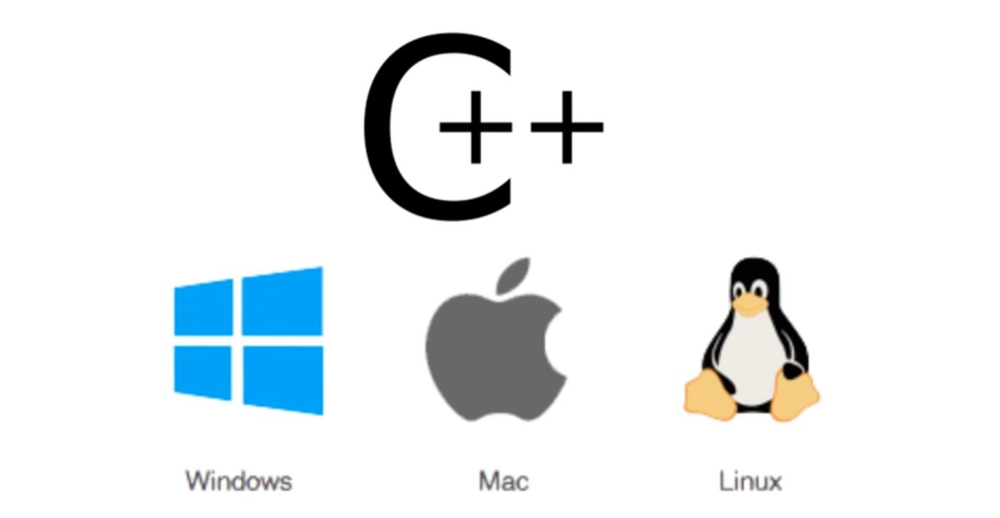
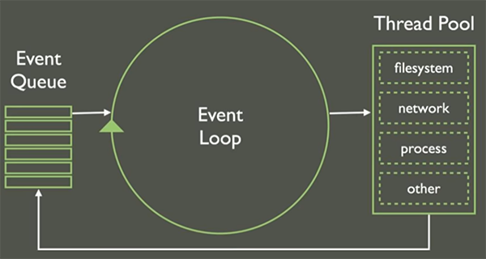

# Primeiros passos com Node.js

Este projeto se trata de um aprofundamento de estudos que se originaram do meu
repositório [conexao-js](https://github.com/lygialima/conexao-js), que foi um
dos meus pontos de partida nos estudos em JavaScript.

Todo o descritivo abaixo sobre Node, incluindo a demo deste repositório, foram
extraídos das vídeo-aulas do Umbler Academy em https://academy.umbler.com/primeiros-passos-com-node.js.

Bem-vindo(a) a este repositório!

## O que é Node.js?

Node.js é uma plataforma, um runtime JavaScript desvinculado do navegador. É o
JavaScript que roda no lado do servidor. Podemos rodar o JavaScript no servidor,
tanto Linux quanto Windows, na nossa máquina. Ele é orientado à eventos. Responde
às coisas que acontecem na nossa aplicação. É uma tecnologia gratuita e de código
aberto.

Criado por Ryan Dahl, pesquisador, ele entendeu, analisando como páginas web
funcionavam, que boa parte do tempo os recursos consumidos por aquelas aplicações
eram mal utilizados. Era ineficiente a forma como as aplicações lidavam com os
recursos da máquina.

Uma aplicação web tradicional gera uma thread para cada requisição, que vai lidar
com o seu processamento. Há cenários em que a thread pode ficar bloqueada quando
estivermos carregando algum arquivo ou fazendo um processamento mais pesado.
Neste caso, o recurso fica alocado pra nossa requisição até que se termine, mesmo
que estejamos somente esperando uma resposta do banco de dados ou que um arquivo
termine de ser criado.

    THREAD = FLUXO DE EXECUÇÃO

Ryan entendeu que isso causava um consumo excessivo de recursos do servidor, e
ele teve a idéia, então, de criar o Node.js.

Foi pego uma tecnologia, também de código aberto, chamada [V8](https://v8.dev/),
um runtime JavaScript criado pelo Google, o mesmo interpretador já utilizado
no Chrome que o Google disponibilizou publicamente pra que ele pudesse fazer
algumas coisas no servidor, que o JavaScript, originalmente, não foi criado para
como, por exemplo, mexer com banco de dados e arquivos. E foi criada, também, uma
biblioteca chamada [Libuv](https://github.com/libuv/libuv) que proporciona
habilidades mais server-side ao JavaScript tradicional.

A junção dos dois gerou o Node.js. Ambos são escritos em C++ e são portáveis para
diferentes sistemas operacionais, como Windows, Mac e Linux. Assim como suas
tecnologias de origem, Node.js é portável nessas mesmas plataformas.

## Como funciona?

Basicamente, o que Ryan propôs é algo que é feito, também, no servidor [NGINX](https://www.nginx.com/), onde cada requisição não gera uma nova thread.
Ao invés disso, a aplicação Node roda em uma thread única (_single thread_)
que verifica o que precisa ser feito com aquela requisição e, se houverem tarefas
bloqueantes, por exemplo, um acesso a disco, um acesso a banco de dados, ou qualquer
tarefa que vá consumir muito tempo, ela delega para um _pool de threads_ que fica
em background rodando e processando. Essa thread principal fica em um _event loop_
eterno, processando as requisições, delegando para as threads em background as
tarefas mais pesadas, onde ao finalizar essas tarefas devolvem o resultado para
o _event loop_ pra que ele continue a sua execução.

Isso tornou todo o processo muito mais eficiente. Conseguimos ter um aproveitamento
melhor dos recursos da nossa máquina.

## Vantagens

* Leveza
* Linguagem JavaScript (baixa curva de aprendizado)
* Performance
    - consumo de memória muito menor
    - aproveitamento de CPU muito maior
    - sem processos ociosos
    - natureza assíncrona (_pool de threads_, _callbacks_, _promises_, _async await_)
* NPM (gerenciador de pacotes nativo do Node)
    - milhares de extensões, plugins e integrações
    - instalações rápidas e fáceis através do console
    - alta produtividade

## Quem utiliza?

* Cenários de usos:
    - APIs e serviços
    - bots e automação
    - mensageria
    - aplicações real-time e colaboração
    - backend de games
    - IoT

## Demo – Instalação

1. Baixe a versão LTS pra sua máquina pelo site do Node (https://nodejs.org)

2. Acesse um terminal de linha de comando do seu sistema operacional

3. Digite `node -v` para ver a versão do Node instalada em sua máquina, para
confirmar a instalação do Node

4. No topo da página à direita, clique em _Fork_ para ter uma
cópia deste repositório na sua conta GitHub (se quiser contribuir neste projeto)

... ou simplesmente ...

Baixe a pasta na sua máquina, clicando no botão _Clone or Download_

### Criando um servidor http com Node.js
([Vídeo-aula Parte 1](https://academy.umbler.com/primeiros-passos-com-node-js/))

Para rodar o servidor na pasta _teste_umbler_, basta acessar a pasta e digitar:

    node index

... onde _index_ é o nome do arquivo existente nessa pasta

    Acesse o navegador e digite 127.0.0.1:3000

### Usando o framework Express
([Vídeo-aula Parte 2](https://academy.umbler.com/primeiros-passos-com-node-js-video-2/))

Para rodar o servidor na pasta _teste_umbler2_, basta acessar a pasta e digitar:

    npm start

    Acesse o navegador e digite 127.0.0.1:3000    

... ou apenas dê _refresh_ se já estiver com esse endereço aberto
